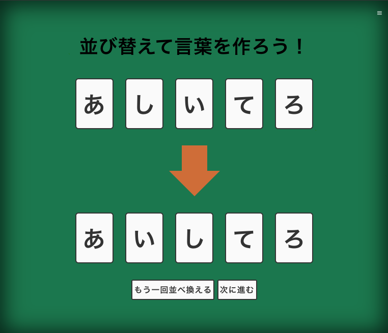
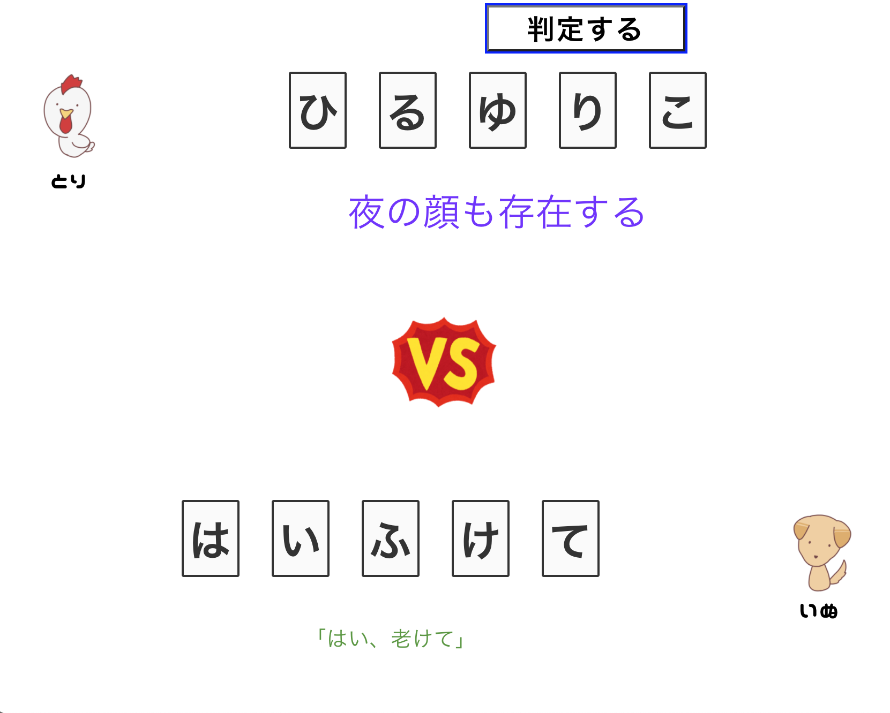

  # ひらがな DE ポーカー

  

  ## ひらがな DE ポーカーとは
    "ひらがな DE ポーカー"は、ポーカーのようでそうでない…一風変わったカードゲームアプリです。

 

  ### :link:サイトURL: 
[https://hiragana-de-porker.web.app/](https://hiragana-de-porker.web.app/)

 

  ### 制作・動作確認環境:  
Mac GoogleChrome(ver: 最新)  
iOS 13 GoogleChrome,safari (画面サイズ: iPhoneで言うと6以上)) 
 
*PCでのプレイ時、ブラウザ画面高640px以上推奨 
 

  #  ひらがな DE ポーカー とは

元となるゲームは、数年前にTwitterで話題になったゲーム「ひらがなポーカー」。

五十音のひらがなの中から一文字づつ記されたカードを使ったゲームです。

ランダムで配られた５枚のカードを、面白い言葉のになるように並べ替え、プレイヤー同士発表し合います。

勝敗は「面白い方が勝ち！」というユニークなゲームです。

   

  # ゲームの流れ

  ## 先行するプレーヤーを決める 
  「ひらがなDEポーカー」は、2人のプレーヤーで遊ぶ仕様になっています。

  プリセットされている2つのアバター:chicken: :dog:のうちいずれかを選択し、先行するプレーヤーを決めます。

 

  ## カードを交換する
  先行するプレーヤーから行動を開始します。

  まずは、ランダムに(被りなく)配られる、５枚のカードを確認します。（以降これを手札と呼びます）
  手札の文字達からイメージを膨らませ、交換したいカードがあれば、「カードの交換」を行います。
  (交換は最大で４枚まで行えます。)

   なお、交換して不要になったカードは「交換済みカード」として表示されます。

  

  これ以上交換の必要がないと考えた場合、また、交換を終えた時には、「並び替える」ボタンを押して並び替えの画面に移ります。

 

  ## 手札を並び替える
  手札が揃ったら並び替えに移ります。

  並び替え画面に用意されている２組のカード達のうち、上段が"元の並び"の手札、下段が"並び替え後"の手札となります。

  まずは、上段の手札を並ばせたい順番にクリックすることで、下段に新しい並びの手札が作成されてゆきます。

  

  並びを直したい時（また、文字が被ってしまった時）には、画面下部の「もう一回並び替える」を押すことで、始めからやり直すことができます。

  

  思った通りに並び替えたら、「次へ進む」を押します。

 
 

  ＊ ( 濁点、半濁点の添加機能作成中 )

 
 

  ## コメントを添える
  このウィンドウでは、完成した言葉に対して、任意のコメントを添えることができます、

  例えばTwitterで、面白い写真をtweetする際に、一言ボケコメントを添えて笑いを誘うように、気の利いた一言コメントを添えたり。
  または、なんでもない言葉でも詳しいシチュエーションを説明して面白くしてみたり。それぞれの発想で活用してください。

  

  使い方としては、
  ・テキストエリアを選択して文字入力(上限は140文字)。
  ・テキストエリア下のツールバーの各ボタンを押すことで、書式の変更が行えます(全体に一括してかかります)。

  また、並び替えに戻りたい時は、「並び替えに戻る」ボタンを押します。この時、入力途中のものは削除されませんので、安心して選択してください。

 
  満足したところで、「行動を終える」ボタンを押し、次プレイヤーにバトンタッチします。

 
 

  ## 後行プレーヤーのターン
  後行のプレイヤーも、先行のプレイヤーと同じ流れでプレイします。
  
  後行プレイヤーが、コメントを添える画面で「行動を終える」ボタンを押した時に、判定に移ってよいかどうか確認するモーダルウィンドウが現れます。
  問題なければそのまま肯定し、判定画面に映ってください。

 

  ## 判定(発表)画面
  各プレーヤーが作った"文字"と”コメント”が発表されます。
  先行プレーヤーが上に、後行のプレーヤーが下に、アバターとともに縦に並んで表示されます。

 
 

  

 
 

## 投票する

「判定する」ボタンを押すことで、投票に移ります。 
勝敗は各プレイヤーの感覚に委ねられます。 

各プレイヤーに対し、勝敗を問うモーダルが表示されますので、正直にどちらが勝ったか答えて下さい。

 
 

最後に、結果の表示がされ、ゲーム終了となります。

 

お疲れ様でした！

 
 

***

 

  ## 制作背景

ライブラリを使わないJavaScript、Webpack4を用いたコンパイル、Sassや、FLOCSSを用いた(意識)したCSS等、フロントエンド系の諸技術を使用した習作として製作しました。

 

***

 

  ## なぜこのゲームを作ったのか

  - 流行ったのは数年前ですが、前とはいえ普遍的な面白さがあること。 
  - 「やってみたいね」と言う話になったが既製品でアプリが見つからなかったこと。 
  - 検索すると、 [*** アプリ] のように表示されるが、どうやら既製品がないこと。 
  - ゲームのルールには著作権が適用されないこと。 

 

***
 

:copyright: MasatoYamada

